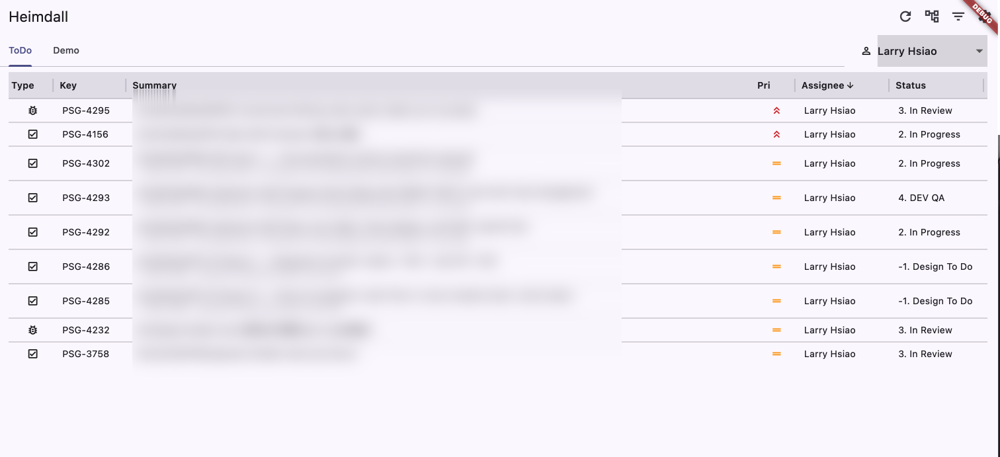

# Heimdall

A small desktop window that lists Jira tickets from filters you choose. Mostly read-only — the watchman, with a single hand on the workflow gate.

Named for the Norse watchman of Bifröst, who marks what approaches — and, with the Gjallarhorn, sounds when a thing must move.



## Why

Jira's web UI is heavy, slow, and screen-greedy. The friction is not its container — it is the editing chrome itself: the busy panels, the modal dialogs, the bloat. Heimdall ships only what the editing chrome was hiding: a list of titles and statuses, refreshed on demand.

Writes that move a ticket along its workflow — status transitions, assignee changes, plain-text comments, and inline task-list ticks — are supported, since each is voice and pace, not editing: *who* the ticket sits with belongs to the same gesture as *where* it stands. Structural edits (summary, field changes, attachments, links) stay in the web UI. The web handles those, and so does any Jira CLI. Heimdall *shows*, and lets you usher a ticket along its workflow.

## Requirements

- [Flutter](https://docs.flutter.dev/) 3.10+ (managed here via [FVM](https://fvm.app))
- An Atlassian account with an [API token](https://id.atlassian.com/manage-profile/security/api-tokens)
- Targets: macOS and Windows desktop

## Install (macOS)

Grab `heimdall.dmg` from the [latest release](https://github.com/LarryHsiao/Heimdall/releases/latest), open it, and drag `heimdall.app` into `Applications`. (A `heimdall.zip` is published alongside if you'd rather skip the disk image — unzip with Finder and move the app yourself.)

On first launch, macOS Gatekeeper may pause to verify the build. Heimdall is signed with Developer ID and notarized by Apple, but the very first open after download requires either an online verification or a one-time bypass. Two ways past it:

- **Right-click the app → Open**, then *Open* in the dialog. Subsequent launches don't ask.
- **Or, in Terminal**, drop the quarantine attribute:

  ```bash
  xattr -dr com.apple.quarantine /Applications/heimdall.app
  ```

If you see *"could not be verified"* or *"is damaged"*, the first cause is usually no network — Gatekeeper checks Apple's notary service the first time. Reconnect and retry. If the staple still fails, the archive may have been extracted by a tool that dropped the ticket; re-download with Finder.

## Setup

```bash
git clone git@github.com:LarryHsiao/Heimdall.git
cd Heimdall
fvm flutter pub get
fvm flutter run -d macos     # or: -d windows
```

## First Run

1. The window opens to an empty state — *No credentials configured.*
2. Open **Settings** (gear icon) and enter:
   - **Base URL** — e.g. `https://your-org.atlassian.net`
   - **Email** — your Atlassian login
   - **API Token** — from `id.atlassian.com` → Security
   - **Appearance** — Light / Dark / System; defaults to System, persists across launches.
3. Save, return, and tap **Add filter**. Each filter takes either:
   - A **filter ID** (e.g. `10363`) — Heimdall wraps it as `filter = 10363`
   - A raw **JQL** expression (e.g. `assignee = currentUser() AND resolution = Unresolved`)
4. Each filter becomes its own tab across the top. Tickets render in a sortable, resizable table (Type · Key · Summary · Pri · Assignee · Status). Sub-tasks indent under their parent in **Grouped** mode; **Flat** mode treats every row as its own line — toggle in the AppBar.
5. Click most cells to open the ticket in the in-app **detail page** — header, status pill, type and priority chips, assignee/reporter/dates, and the description rendered as Markdown. A **Comments** pane to the right (or below, on a narrow window) lists existing comments and accepts new plain-text ones. The detail page bears its own *Open in browser* and *Refresh* actions, and the status pill there pops the same transition menu as the table. Click the table's **Status** cell directly to skip the detail page and pick a transition in place — Heimdall calls Jira's transition endpoint and refreshes the section. The **Assignee** cell behaves the same: tap it (or the assignee line on the detail page) to pop a picker of the project's assignable users, with an *(Unassigned)* row at the top; on tap, Heimdall calls Jira's assignee endpoint and refreshes the section.

## View

- **Tabs** — one per filter, scrollable when many.
- **Sort** — click any column header. Click again to reverse.
- **Resize** — drag the divider on a header's right edge; widths persist across launches.
- **Quick filter** — assignee dropdown to the right of the tab strip; filters in memory, never touches Jira's JQL.
- **Search** — text field beside the tab strip; live-filters visible rows by key, summary, assignee, or status (substring, case-insensitive). In memory only.
- **Open by key** — the `#` icon in the AppBar pops a small dialog; type a key like `PSG-1234` and press Enter to jump straight to its detail page.
- **Mode toggle** — Grouped (default) or Flat, in the AppBar; persists across launches.
- **Auto-refresh** — the active tab's section reloads every 60 s while the window is focused; pauses when blurred or hidden. Other tabs hold until you click Refresh or rotate to them.
- **Detail page** — row click opens it; description ADF is converted to Markdown and rendered with `flutter_markdown_plus`. Inline task lists (ADF `taskList`) render as GFM checkboxes — tap to flip TODO/DONE; the change PUTs the modified description back to Jira and the local view updates optimistically.
- **Comments pane** — read existing comments, post new plain-text ones; lives at the right of the detail page on wide windows, below the description on narrow ones. Auto-refreshes every 30 s while the window is focused; pauses when blurred or hidden.
- **Attachments** — image attachments render as a thumbnail wrap below the description; tap to open full size in a zoomable dialog. Non-image attachments appear as filename chips that open the file URL in the browser. Read-only — uploads, renames, and deletes stay in the web UI.
- **Sub-tasks & Links** — sub-tasks list below the description; issue links group by their directional label (`blocks`, `is blocked by`, `relates to`, …). Each row carries type icon · key · summary · status; tap opens that ticket's own detail page on top of the navigation stack.
- **Hidden sub-tasks indicator** — when a filter or search elides a parent's sub-tasks from the table, a small icon marks the parent row; tap to expand the elided children inline, indented under the parent and dimmed to mark them as filter-elided. Tap again to collapse.
- **Assignee picker** — tap the **Assignee** cell in the table, or the assignee line on the detail page, to pop a dialog of the project's assignable users with a search box and an *(Unassigned)* row at the top. Tapping a row commits the change and refreshes the section optimistically; no Save button. Backed by Jira's `/user/assignable/search` and `/issue/{key}/assignee` endpoints.

## Storage

- **Credentials** — `flutter_secure_storage`: Keychain on macOS, Credential Manager on Windows.
- **Filter list** — `shared_preferences`: JSON-encoded, plain on disk.
- **View settings** — `shared_preferences`: column widths, sort, view mode.
- **Appearance** — `shared_preferences`: theme mode (light / dark / system).

## Out of Scope

- Tray residency, menu-bar icon, background polling.
- Writes beyond status transitions, assignee changes, plain-text comments, and task-list ticks — summary edits, field edits, attachments, links — stay in the web UI.
- Comment editing, deletion, threading, mentions, rich formatting — comments are post-only and plain text.
- Boards, sprints, admin, full-text search.
- Default filters shipped with the app — every filter is user-added.

## Roadmap

- Window-position and size memory (`window_manager`).
- Configurable auto-refresh interval.
- Tests beyond the boot smoke test.

## Issues

Bug reports and feature requests live on the project's [YouTrack board](https://larryhsiao.com:9081/issues/HEI).

## Project Layout

```
lib/
  main.dart              entry
  app.dart               MaterialApp shell
  data/
    jira_credentials.dart   model
    jira_filter.dart        model + JQL coercion
    jira_ticket.dart        model
    jira_issue.dart         ticket + description + reporter + dates + attachments + subtasks + links
    jira_comment.dart       model
    jira_attachment.dart    model (image + file metadata)
    jira_issue_link.dart    model (link type + direction + related ticket)
    jira_transition.dart    model
    jira_user.dart          model (assignable user — accountId + displayName)
    view_settings.dart      view mode, sort, column widths
    vault.dart              credentials in secure storage
    filters.dart            filters in shared_preferences
    preferences.dart        view settings in shared_preferences
    jira.dart               REST gateway (search/jql + issue + comments + transitions + assignee)
    adf.dart                Atlassian Document Format → Markdown
  ui/
    tickets_page.dart       main view
    ticket_detail_page.dart detail surface for a single ticket
    ticket_chrome.dart      type / priority icon mappings
    status_chip.dart        shared status pill widget
    assignee_picker.dart    dialog: search assignable users, tap to pick
    settings_page.dart      credentials form
    filters_page.dart       filter list management
    filter_form_page.dart   add / edit a filter
```
